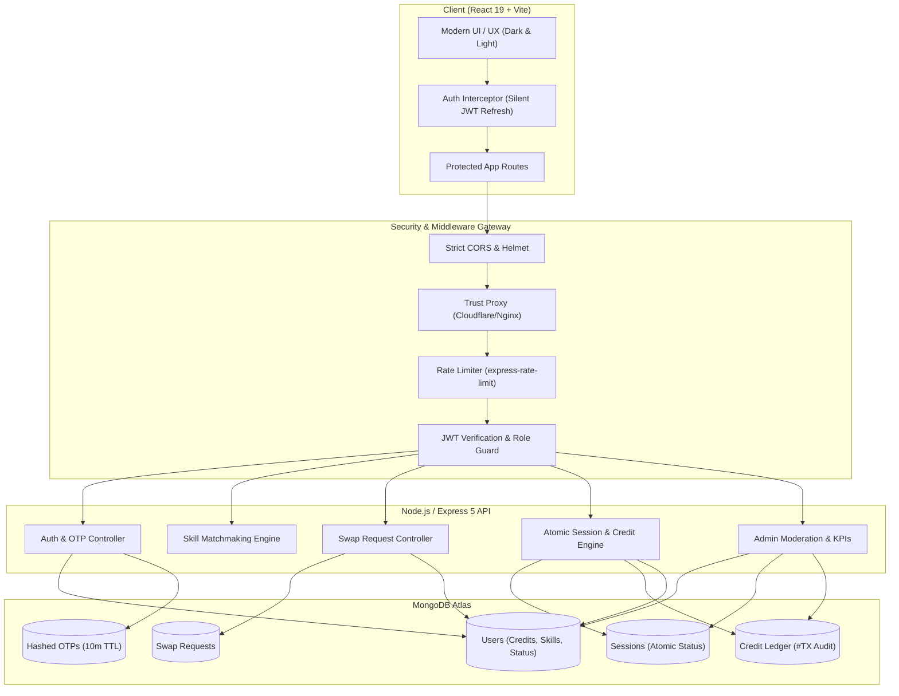

# 🔄 SkillLoop — Peer-to-Peer Skill Exchange Platform

<div align="center">


**Teach what you know. Learn what you love.**  
A modern, credit-based peer-to-peer skill swap community where knowledge is the only currency.

[](https://react.dev/)
[](https://vitejs.dev/)
[](https://nodejs.org/)
[](https://expressjs.com/)
[](https://www.mongodb.com/)
[](#-security--data-integrity)
[](LICENSE)

[Explore Features](#-features) • [Quickstart](#-getting-started) • [Architecture](#-system-architecture) • [API Reference](#-api-endpoints) • [Admin Portal](#-admin-portal--moderation)

---

</div>

## 📖 Overview

**SkillLoop** solves the high-cost barrier of personalized tutoring and skill learning. Instead of paying expensive hourly subscription fees, members exchange expertise directly with one another.

### 💡 The Core Philosophy: **Learn → Teach → Practice → Improve**
- **Teach to Earn:** Mentor a peer in a skill you excel in (e.g., React, Spanish, Graphic Design, Guitar) to earn **+1 Skill Credit**.
- **Spend to Learn:** Use your earned credits to book personalized 1-on-1 learning sessions with expert mentors across the globe.
- **Zero Financial Friction:** Every new member receives **10 Starter Credits** upon email verification to kickstart their learning journey.

---

## ✨ Features

### 🔄 1. Smart Skill Swap Matchmaking
- **Bi-Directional Matching:** Discovers mutual matches where User A teaches what User B wants to learn, and vice versa.
- **Direct Skill Discovery:** Search mentors by category, skill name, expertise level (*Beginner, Intermediate, Advanced*), and availability.
- **Member Cards:** Inspect mentor ratings, review history, teaching badges, and availability before sending a request.

### 📅 2. 1-on-1 Interactive Scheduling & Sessions
- **Seamless Booking Flow:** Learners propose swap requests; teachers accept and configure session date, time, and custom meet links.
- **Auto-Generated Video Rooms:** Instant Google Meet / Zoom meeting room integration.
- **Live Session Controls:** Track student attendance (*Learner Joined* verification) and live meeting status.
- **Automated Settlement:** When a session concludes, the background daemon automatically marks completion and settles credits (+1 Teacher, -1 Learner).

### 💳 3. Fair Credit Economy & Audit Ledger
- **Atomic Balance Guarantees:** Concurrency-locked credit updates prevent duplicate rewards and negative credit balances.
- **Immutable Transaction History:** Every single credit transaction generates a tamper-evident audit ledger entry (`#TX-XXXXXX`) visible on the user's Credits dashboard.
- **Anti-Exploit Protection:** Users cannot schedule sessions or create swap requests without maintaining at least 1 available credit.

### 🏆 4. Gamified Leaderboard & Verified Badges
- **Live Rankings:** Real-time leaderboard highlighting Top Teachers and Top Learners based on completed sessions and community rating.
- **Reputation & Reviews:** Transparent 5-star rating system with verified session reviews.
- **Achievement Badges:** Badges for milestones (*First Session, Master Mentor, Community Pillar*).

### 💬 5. Real-Time Chat & In-App Notifications
- **Direct Messaging:** Built-in chat channel between matched swap partners to coordinate agendas and learning material.
- **Smart Notification Hub:** Real-time alerts for swap proposals, acceptances, credit updates, and meeting reminders.

### 🛡️ 5. Role-Based Admin Portal & Moderation
- **Real-Time KPI Metrics:** Live platform statistics including active users, circulating credits, active sessions, and disputed sessions.
- **User Management:** Search and filter members, inspect transaction logs, change roles (*User / Admin*), and ban bad actors.
- **Dispute Resolution & Reports:** Community moderation queue to inspect flagged sessions, resolve disputes, and maintain platform trust.
- **Category Manager:** Add, edit, or archive skill categories in real time.

### 🌓 6. Aesthetic Modern UI / UX
- **Theme Engine:** Instant Dark Mode and Light Mode switching with persistent local state.
- **Responsive Layout:** Tailored for mobile, tablet, and desktop viewing.

---

## 🔒 Security & Data Integrity

SkillLoop features an enterprise-grade security posture verified through comprehensive static and dynamic security audits:

| Security Layer | Implementation Detail |
| :--- | :--- |
| **Authentication** | Dual-token JWT architecture (Short-lived Access Token in Memory/Header + Long-lived Refresh Token in HttpOnly Secure Cookie). |
| **Token Rotation** | Cryptographic SHA-256 refresh token hashing in MongoDB with token reuse detection and instant session revocation. |
| **Admin Authorization** | Strict `protectAdmin` middleware verifying cryptographic signatures and database roles. Zero backdoors or unauthenticated fallbacks. |
| **OTP Verification** | 6-digit verification codes stored as SHA-256 hashes with an automatic 5-attempt brute-force rate limiter and 10-minute TTL expiry. |
| **Concurrency & Race Conditions** | Atomic MongoDB transactions (`findOneAndUpdate` with status filter) preventing double credit redemption during concurrent completions. |
| **Financial Safeguards** | Negative balance prevention ensuring credits can never drop below 0 (`{ credits: { $gte: 1 } }`). |
| **Network & CORS** | Strict origin matching (prevents substring exploits), `helmet` security headers, and `trust proxy` enabled for Cloudflare / Nginx reverse proxies. |
| **Rate Limiting** | Tiered rate limiting via `express-rate-limit` protecting auth endpoints (20 attempts / 15 mins) and global API routes (1,000 reqs / 15 mins). |

---

## 🛠️ Tech Stack

### Frontend
- **Framework:** React 19 (Hooks, Context API, Portals)
- **Bundler & Tooling:** Vite 8, PostCSS
- **Routing:** React Router 7
- **Icons & Styling:** Custom SVG System & Modular Vanilla CSS Engine
- **State & Storage:** LocalStorage session persistence with silent 401 JWT refresh interceptor

### Backend
- **Runtime:** Node.js v24 (Native ESM)
- **Framework:** Express 5.x
- **Database:** MongoDB Atlas with Mongoose 9.x ODM
- **Security:** Helmet, CORS, Express-Rate-Limit, BCryptJS, Crypto
- **Validation:** Zod Schema Validation
- **Mailing:** Nodemailer (SMTP / Dev Logger Mode)

---

## 🏗️ System Architecture



---

## 📂 Project Structure

```text
skill-loop/
├── backend/
│   ├── src/
│   │   ├── config/              # MongoDB connection, env loader (Zod), email transporter
│   │   ├── controllers/         # Core business logic
│   │   │   ├── admin.controller.js        # KPI metrics, user moderation, disputes
│   │   │   ├── auth.controller.js         # JWT auth, passwordless login, token refresh, logout
│   │   │   ├── credit.controller.js       # User credit ledger and balances
│   │   │   ├── message.controller.js      # Direct in-app messaging
│   │   │   ├── otp.controller.js          # SHA-256 hashed OTPs & social auth
│   │   │   ├── session.controller.js      # Atomic session lifecycle & credit settlement
│   │   │   ├── swapRequest.controller.js  # Swap request workflows
│   │   │   └── user.controller.js         # User profiles & onboarding
│   │   ├── middleware/          # Security, auth, admin guard, error handling, rate limiting
│   │   ├── models/              # Mongoose schemas (User, Session, CreditLedger, Otp, etc.)
│   │   ├── routes/              # Express REST API routes
│   │   ├── seeders/             # Database seed scripts (Admin, Categories, Dummy Data)
│   │   ├── utils/               # JWT token creation, password hashing, email templates
│   │   └── server.js            # Express app entry point
│   ├── .env                     # Backend environment configuration
│   └── package.json
│
├── Frontend/
│   ├── src/
│   │   ├── admin/               # Admin portal pages and management components
│   │   ├── components/          # Reusable UI components (Navbar, Sidebar, Modals, Cards)
│   │   ├── context/             # ThemeContext (Dark / Light mode)
│   │   ├── pages/               # Main application views
│   │   │   ├── BrowsePage.jsx             # Skill exploration & filter
│   │   │   ├── DashboardPage.jsx          # User overview, matches, active swaps
│   │   │   ├── LeaderboardPage.jsx        # Community rankings & badges
│   │   │   ├── LoginPage.jsx              # Member & Admin login tabs
│   │   │   ├── OnboardingPage.jsx         # 3-step skill & availability setup
│   │   │   ├── ProfilePage.jsx            # User profile, skills, bio
│   │   │   ├── RequestsPage.jsx           # Sent & received swap requests
│   │   │   ├── SessionsPage.jsx           # Scheduled, upcoming & completed classes
│   │   │   └── VerifyEmailPage.jsx        # OTP entry & verification
│   │   ├── utils/               # Auth helpers, fetchWithAuth interceptor
│   │   ├── app.jsx              # Route definitions & layout wrappers
│   │   ├── main.jsx             # React DOM entry point
│   │   └── index.css            # Core design system stylesheet
│   ├── vite.config.js
│   └── package.json
│
└── README.md
```

---

## 🚀 Getting Started

Follow these steps to set up and run SkillLoop locally on your machine.

### 📋 Prerequisites
- **Node.js** (v18.0.0 or higher recommended, tested on v24)
- **npm** (v9.0.0 or higher)
- **MongoDB** (A free MongoDB Atlas cluster or a local MongoDB instance running on `mongodb://localhost:27017`)

---

### 1️⃣ Clone the Repository
```bash
git clone https://github.com/Shu-ash/skill-loop.git
cd skill-loop
```

---

### 2️⃣ Configure Backend Environment
Navigate to the `backend` directory and create or inspect the `.env` file:
```bash
cd backend
```

Create a `.env` file with the following variables:
```env
# Application
NODE_ENV=development
PORT=5000
CLIENT_URL=http://localhost:5173

# Database Connection
MONGO_URI=mongodb+srv://<username>:<password>@<cluster>.mongodb.net/skillloop?retryWrites=true&w=majority

# JWT Secrets (Generate secure random 64-character strings for production)
JWT_ACCESS_SECRET=SkillLoop_SuperSecret_Access_Token_Key_2026
JWT_REFRESH_SECRET=SkillLoop_SuperSecret_Refresh_Token_Key_2026
JWT_ACCESS_EXPIRES=15m
JWT_REFRESH_EXPIRES=7d

# Cookies & Security
COOKIE_SECURE=false

# Optional: SMTP Email Credentials (If omitted, OTPs log to console in dev mode)
# SMTP_HOST=smtp.gmail.com
# SMTP_PORT=587
# SMTP_USER=your-email@gmail.com
# SMTP_PASS=your-app-password
```

---

### 3️⃣ Install Backend Dependencies & Seed Database
```bash
# Install dependencies
npm install

# Seed Admin Account and Default Skill Categories
npm run db:seed
```

---

### 4️⃣ Start the Backend Server
```bash
npm run dev
```
> The API server will boot on `http://localhost:5000`.  
> Look for the message: `🟢 MongoDB connected successfully to database: skillloop`.

---

### 5️⃣ Set Up and Run the Frontend
Open a new terminal window, navigate to the `Frontend` folder, install packages, and start Vite:
```bash
cd ../Frontend

# Install dependencies
npm install

# Start Vite development server
npm run dev
```
> Open your browser and navigate to **`http://localhost:5173`**.

---

## 🔑 Default Credentials

The database seeder automatically initializes the following verified accounts:

### 👑 Super Administrator Account
- **Portal URL:** `http://localhost:5173/login` (Select the **Admin Portal** toggle tab)
- **Email:** `admin@skillloop.com`
- **Password:** `admin123`
- **Permissions:** Full access to KPI metrics, user management, banning/unbanning, category editor, and dispute resolution (`/admin`).

### 🎓 Regular Member Account
- You can register any new account using **Sign Up** on `http://localhost:5173/login`.
- New users receive **10 starter credits** automatically.
- In development mode, the 6-digit verification OTP will appear directly in your backend terminal console!

---

## 📡 Key API Endpoints

### 🔐 Authentication (`/api/auth`)
| Method | Endpoint | Description | Auth Required |
| :--- | :--- | :--- | :--- |
| `POST` | `/api/auth/register` | Register a new user and dispatch 6-digit OTP | No |
| `POST` | `/api/auth/verify-email` | Verify email OTP and activate account | No |
| `POST` | `/api/auth/login` | Email + Password authentication | No |
| `POST` | `/api/auth/request-login-otp` | Request passwordless login OTP | No |
| `POST` | `/api/auth/verify-login-otp` | Authenticate using passwordless OTP | No |
| `POST` | `/api/auth/refresh` | Refresh access token using secure HttpOnly cookie | Refresh Token |
| `POST` | `/api/auth/logout` | Invalidate refresh token and clear cookie | Yes |
| `GET` | `/api/auth/me` | Fetch authenticated user context | Bearer JWT |

### 🤝 Skill Swaps & Sessions (`/api/requests`, `/api/sessions`)
| Method | Endpoint | Description | Auth Required |
| :--- | :--- | :--- | :--- |
| `POST` | `/api/requests` | Propose a skill swap to another member | Bearer JWT |
| `GET` | `/api/requests/received` | List incoming swap requests | Bearer JWT |
| `GET` | `/api/requests/sent` | List outgoing swap requests | Bearer JWT |
| `PATCH` | `/api/requests/:id/accept` | Accept request and schedule session date & meet link | Bearer JWT |
| `GET` | `/api/sessions/my-sessions` | Get all scheduled, active, and completed classes | Bearer JWT |
| `PATCH` | `/api/sessions/:id/complete` | Complete session and atomically trigger credit reward (+1/-1) | Bearer JWT |
| `PATCH` | `/api/sessions/:id/reschedule` | Reschedule session date and meeting link | Bearer JWT |

### 💳 Credits & Gamification (`/api/credits`, `/api/reviews`)
| Method | Endpoint | Description | Auth Required |
| :--- | :--- | :--- | :--- |
| `GET` | `/api/credits/my-ledger` | Fetch current credit balance and `#TX` audit history | Bearer JWT |
| `POST` | `/api/reviews` | Submit verified review & star rating for completed session | Bearer JWT |

### 🛡️ Admin Moderation (`/api/admin`)
| Method | Endpoint | Description | Auth Required |
| :--- | :--- | :--- | :--- |
| `GET` | `/api/admin/metrics` | Platform overview: active users, total sessions, circulating credits | Admin JWT |
| `GET` | `/api/admin/users` | List, search, and paginate registered members | Admin JWT |
| `PATCH` | `/api/admin/users/:id/status` | Ban or reactivate user account | Admin JWT |
| `PATCH` | `/api/admin/users/:id/role` | Promote/demote user between User and Admin | Admin JWT |
| `GET` | `/api/admin/categories` | Fetch and manage platform skill categories | Admin JWT |
| `PATCH` | `/api/admin/sessions/:id/dispute` | Settle disputed session credits | Admin JWT |

---

## 📜 Available Scripts

### Backend (`/backend`)
- `npm run dev` — Starts the Express API server with `nodemon` live-reload.
- `npm start` — Starts production Node.js server.
- `npm run db:seed` — Runs database seed script for admin and initial categories.
- `npm run db:clean` — Safely resets test database.

### Frontend (`/Frontend`)
- `npm run dev` — Starts Vite dev server with instant HMR (`http://localhost:5173`).
- `npm run build` — Compiles and minifies production assets into `/dist`.
- `npm run preview` — Locally preview the production build.

---

## 🤝 Contributing

Contributions make the open-source community an incredible place to learn, inspire, and create. Any contributions you make are **greatly appreciated**!

1. Fork the Project
2. Create your Feature Branch (`git checkout -b feature/AmazingFeature`)
3. Commit your Changes (`git commit -m 'Add some AmazingFeature'`)
4. Push to the Branch (`git push origin feature/AmazingFeature`)
5. Open a Pull Request

---

## 📄 License

Distributed under the **MIT License**. See `LICENSE` for more information.

---

<div align="center">

Made with ❤️ for collaborative, accessible learning by the **SkillLoop Community**.

[](https://github.com/Shu-ash/skill-loop)
[](https://github.com/Shu-ash/skill-loop)

</div>
